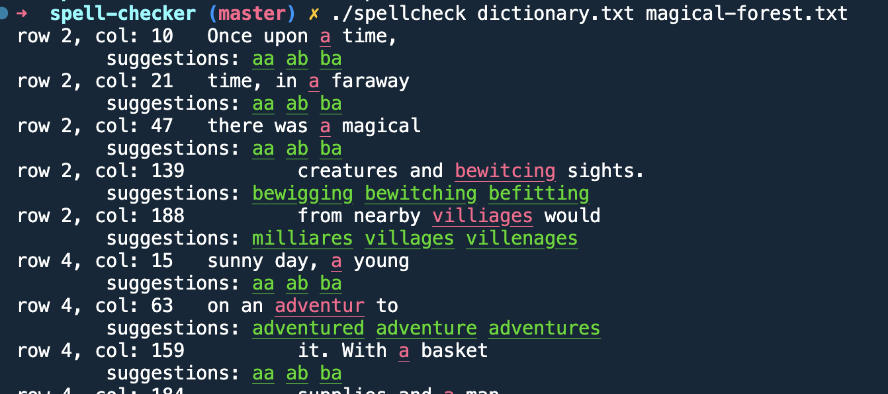

# Make a spell checker!

## Implementation - Austin Carter 

### building
The project strucure is not too complicated, all sorce code lives in the spell-checker/src folder. I have included a makefile to help build the project. Currently the compiler is set to g++, if on a mac without g++ installed clang++ can also be used by editing the following line in makefile:

`g++ -std=c++11 -o spellcheck ${SRC_FILES} -I${INCLUDE_DIR}`

to:

`clang++ -std=c++11 -o spellcheck ${SRC_FILES} -I${INCLUDE_DIR}`

*Note*: If building on windows and not using g++/wsl I can put put together the build command for `msvc`

```
    git clone git@github.com:AustinCarter/voze-coding-exercises.git
    cd voze-coding-exercises/spell-checker
    make
    ./spellcheck dictionary.txt text.txt
```

#### example output



### Spellcheck

To implement the spell checking, I opted for a simple solution using a set to store the words that are in the dictionary in an unordered (hash) set. This makes both of the operations we need to support, word insertions and lookups, 0(1). I originally was also building a trie along with the set with the intention of using it when giving spelling corrections, however as I will discuss in [Autocorrect](#autocorrect), I ended up using a different approach for suggestions.

### Line number and context

C++'s file streams don't give much information other than access to the data stream being read from the file. Inorder  to provide the location that a misspelling is at, I maintained a cursor position that is updated to have the row and column indexes for the most recently read word. When we encouter a misspelled word, we can use the cursor to print the start location of the misspelled word. The file is read line by line and then split on " " as a delimeter, I did this because there is no way to know we have finished reading a line unless we do reads line by line and increment the row number of our cursor once we have reached the last word of the line.

### Autocorrect

Above I mentioned that I originally intended to use a trie build from all the words in our dictionary to do spell correct. I lated opted against this approach, and I think a trie is better suited to do autocomplete than it is to do autocorrect. My concern was that recommendations given using a trie would favor the prefix of the misspelled word, meaning if the misspelling happened in the first characters, it is likely that the recommendation would be far from the intended word. I instead decided it would be better to use edit distance as the metric for which word to be used, and looked into [BK-trees](https://www.geeksforgeeks.org/bk-tree-introduction-implementation/#) rather than iterating over each word of the dicitionary. Using a BK-tree allows us to limit the search space of the word we need to compare our mispelling againt based on a tolerence value we can set. 

I opted for a tolerence value of 3, though I made the tolerence smaller for 1 and 2 character words. I found that recommendations for smaller words could become unintuitive if they had too large of an edit distance, e.g. the character `i` probably shouldn't become `at`, though that is valid with an edit distance of 3. 

Giving all recommendations within an edit distance of 3 would be too overwhelming to be useful, so instead I found the 3 candidate words with the smallest edit distance from our misspelling and used those as the suggestions. It is worth noting that this will mean that some words are more likely to be recommended, because we always encounter words from a branch in the same order and if 4 words have the same edit distance the first 3 we saw will be recommended.

It is worth noting that the building of the BK-tree is not well optimized at the moment, and currently takes noticiably longer than constructing the trie was, I still chose to stick with this method as the recommendations it provides feel closer to the recommendations I would expect.

## Proper nouns

To handle proper nouns, I treat words with the first letter capitalized and the rest of the word lower-case as a proper noun. One notable issue with this is that the first word of a sentence will always be treated as a proper noun (assuming proper capitalization.) This could be fixed by having the dictionary class store state that keeps track of if the last word had a period at the end.
This would however it's own drawbacks, the first word of a sentence would never be treated as a proper noun and words such as e.g. would register as a new sentence. 

In a real life scenario handling proper nouns vs. first word would require a much more sophisticated approach that is more context aware and has a stronger understanding of grammar rules (and probably common names/places as well).

## limitations and improvments

Given I had a busy week and limited time, there are plenty of ways I think this could be improved. I noted some that stood out to me as I went along.

- Currently I do not handle posessives, `Lily` will be treated as a proper noun but `Lily's` will be treated as a mispelled word. This could be fixed by checking if capitalized words end in `'s`
- I am using Levenshtein edit distance when constructing the BK-tree, this does not account for transposition of letters when finding the edit distance. If allwoing transposition of adjacent characters, a mispelling like `rihgt` would only be an edit distance of 1 away from `right`, this would improve the recommendaitons we are able to give.
- Another improvment I think would help improve recommendations is to have a metric to account for how far the keys corresponding to the letters are from each other. For example, `cae` is more likely a mispelling of `car` than it is of `cap`, since the `e` and `r` keys are adjacent
- Currently we don't handle UNICODE/multibyte characters correctly, meaning this autocomplete is only viable for UTF-8 text at the moment.
- There is definite room for optimization, two I thought of were:
    - Cache the recommendations for common/recent misspellings, that way we don't have to iterate the tree and construct a heap for a recommendation each time we see it
    - Currently the dictionary.txt file is being read twice, once to construct our dictionary, and another time to construct the autocorrect BK-tree. We could construct these both in one pass of the file, saving file io time.

---
## Prompt

Write a program that checks spelling. The input to the program is a dictionary file containing a list of valid words and a file containing the text to be checked.

The program should run on the command line like so:

```text
<path to your program> dictionary.txt file-to-check.txt
# output here
```

Your program should support the following features (time permitting):

- The program outputs a list of incorrectly spelled words.
- For each misspelled word, the program outputs a list of suggested words.
- The program includes the line and column number of the misspelled word.
- The program prints the misspelled word along with some surrounding context.
- The program handles proper nouns (person or place names, for example) correctly.


## Additional information

- The formatting of the output is up to you, but make it easy to understand.
- The dictionary file (`dictionary.txt` in the example above) is always a plain text file with one word per line.
- You can use the `dictionary.txt` file included in this directory as your dictionary.
- The input file (`file-to-check.txt` in the example above) is a plain text file that may contain full sentences and paragraphs.
- You should come up with your own content to run through the spell checker.
- Use any programming language, but extra credit for using Java or Kotlin.
- Feel free to fork the repo and put your code in there or create a new blank repo and put your code in there instead.
- Send us a link to your code and include instructions for how to build and run it.
- Someone from Voze will review the code with you, so be prepared to discuss your code.
